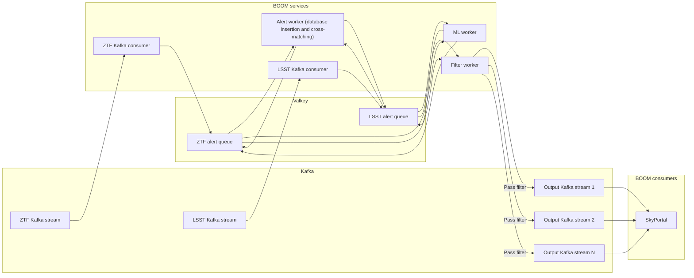

# Alert processing

BOOM consumes Kafka streams of alerts from astronomical surveys
and outputs Kafka streams for consumers like SkyPortal.

Each alert is processed with the following pipeline:

1. Cross-matches with object IDs from other data catalogs are added.
   This is done based on the location (right ascension and declination)
   of the object in the alert. So, for example, if Rubin sends an alert
   for a given object and then ZTF sends an alert for that same object later,
   the ZTF alerts will have the object ID from the Rubin catalog.
   However, the Rubin alert has already been sent out, so it will not have
   information about the ZTF alert.
2. Machine learning model classification scores are added.
3. A series of user defined filters are applied, resulting in one boolean
   value for each. Any alert that passes through a given filter is sent
   to a dedicated Kafka output stream for that filter.
4. The alert is save in a database for later querying and cross-matching.

The implementation is as follows:

