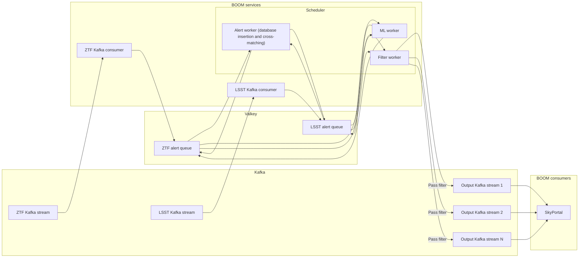

# Alert processing

BOOM consumes Kafka streams of alerts from astronomical surveys
and outputs Kafka streams for consumers like SkyPortal.

Each alert is processed with the following pipeline:

1. Alerts are normalized to unify their schemas as much as possible.
   Their data is split and inserted into an alert dataset,
   an object dataset, and an image dataset, named according to the survey
   with which it is associated.
1. Cross-matches with object IDs from other data catalogs
   (from both live and archival surveys) are added.
   This is done based on the location (right ascension and declination)
   of the object in the alert.
1. Machine learning model classification scores are added.
1. A set of user-defined filters are applied.
   Any alert that passes through any filter is sent
   to a dedicated Kafka output stream for that alert's input stream.

The implementation is as follows:

