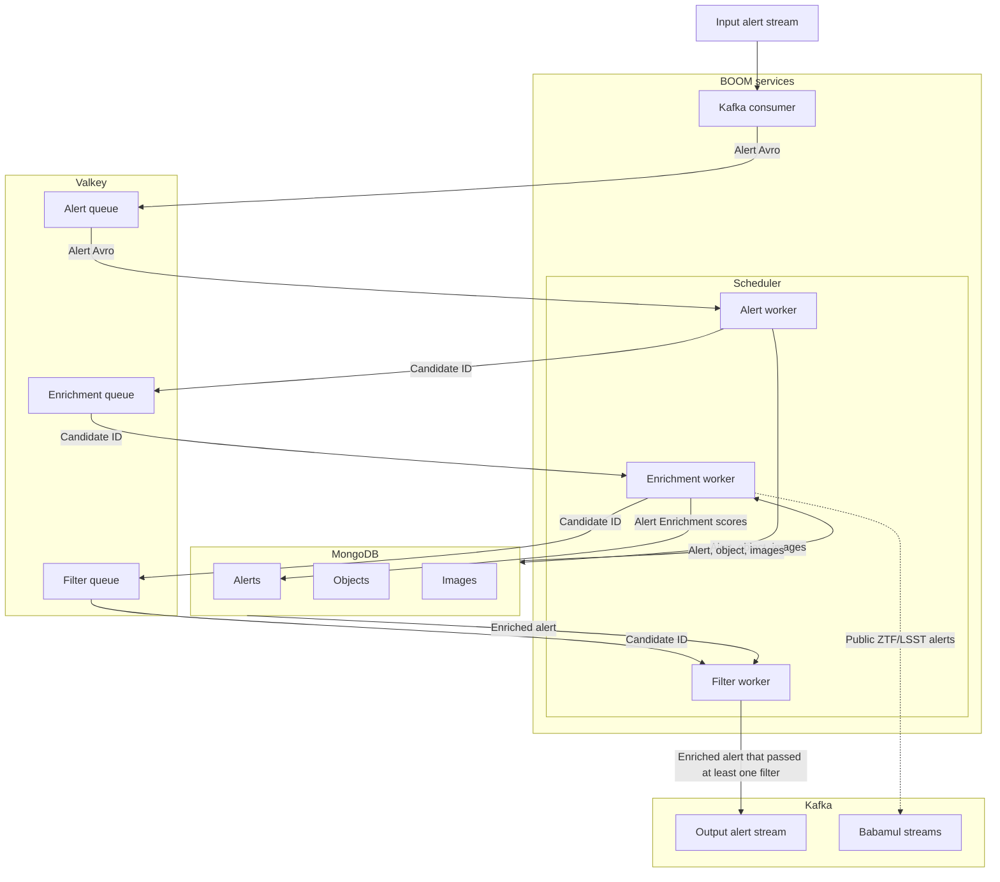

# Alert processing

BOOM consumes Kafka streams of alerts from astronomical surveys
and outputs Kafka streams for consumers like SkyPortal.

Each alert is processed with the following pipeline:

1. Alerts are normalized to unify their schemas as much as possible.
   Their data is split and inserted into an alert dataset,
   an object dataset, and an image dataset, named according to the survey
   with which it is associated.
2. Cross-matches with object IDs from other data catalogs
   (from both live and archival surveys) are added.
   This is done based on the location (right ascension and declination)
   of the object in the alert.
3. Machine learning model classification scores and other properties are added
   to "enrich" the alerts.
4. A set of user-defined filters are applied.
   Any alert that passes through at least one filter is sent
   to a dedicated Kafka output stream for that alert's input stream.

Data flows through the system as follows:


```mermaid
graph TB

    Input[Input alert stream]

    subgraph Kafka
        Output[Output alert stream]
        BabamulOutput[Babamul streams]
    end

    subgraph Valkey
        AlertQueue[Alert queue]
        EnrichmentQueue[Enrichment queue]
        FilterQueue[Filter queue]
    end

    subgraph MongoDB
        direction TB
        AlertCollection[Alerts]
        ObjectCollection[Objects]
        ImageCollection[Images]
    end

    subgraph BOOM services
        KafkaConsumer[Kafka consumer]
        subgraph Scheduler
            AlertWorker[Alert worker]
            EnrichmentWorker[Enrichment worker]
            FilterWorker[Filter worker]
        end
    end

    Input --> KafkaConsumer
    KafkaConsumer -- Alert Avro --> AlertQueue
    AlertQueue -- Alert Avro --> AlertWorker
    AlertWorker -- Candidate ID --> EnrichmentQueue
    AlertWorker -- Alert, object, images --> MongoDB
    EnrichmentQueue -- Candidate ID --> EnrichmentWorker
    EnrichmentWorker -- Candidate ID --> FilterQueue
    EnrichmentWorker -- Alert Enrichment scores --> AlertCollection
    EnrichmentWorker -. Public ZTF/LSST alerts .-> BabamulOutput
    MongoDB -- Alert, object, images --> EnrichmentWorker
    FilterQueue -- Candidate ID --> FilterWorker
    MongoDB -- Enriched alert --> FilterWorker
    FilterWorker -- Enriched alert that passed at least one filter --> Output
```

MongoDB serves as the storage, cross-matching, and filtering engine.

When scaling the system to include additional live survey input streams,
each one will have its own:

- Kafka consumer
- Alert queue
- Alert workers
- Enrichment queue
- Enrichment workers
- Filter queue
- Filter workers
- Alert collection
- Object collection
- Image collection
- Output stream

## Re-enriching alerts after a change

Enrichment happens **once**, as an alert is ingested. Nothing revisits an alert
afterwards, so a change to enrichment — a new classifier, a retrained model, a
corrected formula — leaves every alert already in the database holding values
the current code would not produce.

The problem is that a stale value looks exactly like a current one.
`classifications.btsbot` is present before and after a model swap; only the
number differs, and nothing on the document says which model produced it. The
same applies to everything under `properties`, which is computed by BOOM's own
code rather than a model.

You can see where this has been worked around by hand. `ZtfAlertProperties.sso`
is an `Option` whose doc comment warns that `None` means "enriched before this
field existed", not "evaluated and found not to be a solar system object". That
is this problem, patched one field at a time.

### The enrichment set

Each alert therefore carries an integer, `enrichment_set`, naming a row in the
`enrichment_sets` collection that records exactly what produced its enrichment:

```jsonc
{ "_id": 7, "survey": "ztf",
  "models": {
    "acai_h": { "name": "d1_dnn_20201130", "sha256": "ab12…" },
    "btsbot": { "name": "v2.0.0",          "sha256": "cd34…" }
  },
  "derivations": { "photstats": 1, "sso": 1, "crossmatch_flags": 1,
                   "detection_history": 1 },
  "fingerprint": "…", "first_seen": 1765000000 }
```

One integer per alert rather than a version per field: at BOOM's scale the
difference is tens of gigabytes of bookkeeping. Finding stale alerts is then
`{ enrichment_set: { $ne: <current> } }` — indexable and exact.

Sets record **components**, not one opaque number, so a diff says *which* part
moved. If two sets differ only in `btsbot`, the alerts at the older set need
that one model re-run, not all six.

### Models are hashed, derivation logic is declared

A model's identity is the SHA-256 of its file. A filename is a claim — the
weights behind `acai_h.d1_dnn_20201130.onnx` could be replaced without anyone
renaming it — and a hash cannot lie. Models are declared once in
`ZTF_MODELS` (`src/enrichment/version.rs`), which is both what the worker loads
and what gets hashed, so the two cannot disagree.

Derivation logic cannot be hashed the same way. "Did this change alter the
output?" is a semantic question: a refactor does not, a corrected formula does,
and hashing the source would flag every comment edit until nobody trusted it.

**So when you change enrichment logic in a way that alters what it writes, bump
the matching version in `DERIVATIONS`.** The components are deliberately coarse:

| Component | Covers |
| --- | --- |
| `photstats` | `properties.photstats`, `multisurvey_photstats` |
| `sso` | `properties.sso`, and the activity metrics derived from it |
| `crossmatch_flags` | `rock`, `star`, `near_brightstar`, `stationary` |
| `detection_history` | `properties.detection_history` |

Erring toward bumping costs a reprocessing run. Erring the other way leaves
values that look current and are not — which is the failure this exists to
prevent, and the one nobody notices.

### Kicking off a re-enrichment

From the admin page, or the API:

```bash
curl -X POST http://localhost:4000/tasks \
  -H "Authorization: Bearer $TOKEN" -H 'Content-Type: application/json' \
  -d '{"task_type": "enrich_reprocess",
       "params": {"survey": "ztf", "selection": {"kind": "stale"}}}'
```

`selection` decides what gets reprocessed:

| Selection | Use it when |
| --- | --- |
| `{"kind": "stale"}` | **After changing a model or a derivation.** Selects everything not enriched by the current set, including alerts predating stamping. |
| `{"kind": "missing_field", "field": "classifications.acai_h"}` | Adding a classifier, where the field genuinely does not exist yet. |
| `{"kind": "candid_range", "from": …, "to": …}` | Reprocessing a known import. |
| `{"kind": "all"}` | Everything. Hundreds of millions of alerts. |

Prefer `stale` after a change. `missing_field` only finds alerts that never had
the field, so after a model changes it selects **none of them** — every alert
still has the field, just with an old value.

The task selects the alerts, queues them, runs the enrichment workers over them,
and finishes when the queue drains. It disables Babamul and does not forward to
the filter queue, so reprocessing never re-alerts anyone.

### Watching and controlling a run

The admin page shows active runs with a progress bar and a live log tail. Or:

```bash
curl -s .../tasks | jq '.data[] | {task_type, status, progress}'   # recent runs
curl -s .../tasks/<run_id>/logs?after_seq=0                        # tail the log
curl -X POST .../tasks/<run_id>/cancel                             # stop it
```

Cancelling stops the workers at a batch boundary rather than mid-alert. Because
re-enrichment is idempotent — scores are recomputed from the stored alert —
resubmitting after a cancellation or a failure picks up the remaining work: the
alerts already done now carry the current set and no longer match `stale`.

A run competes with live ingest for the same GPU and model mutexes. `n_workers`
throttles it, and a backfill that takes a week without delaying tonight's alerts
is better than one that takes two days and does.

`GET /data/mutations?collection=ZTF_alerts` shows what past runs did, including
the enrichment set each one wrote. See [the task system](./task-system.md).

### What this does not do yet

- **Selective re-running.** The set records components and `version::diff` says
  which moved, but `enrich_reprocess` re-runs the whole enrichment for a
  selected alert rather than only the changed part. The information needed to
  narrow it is recorded; the narrowing is not built.
- **Catching a forgotten version bump.** Nothing verifies that a change to
  derivation logic came with a bump — it is a code-review responsibility. A
  golden-output test (fixed input alerts, checked-in expected output, failing
  when output changes without a version change) is the natural guard and does
  not exist yet.
- **Alerts enriched before stamping.** They have no `enrichment_set` and so
  match `stale` forever until reprocessed. That is the honest answer — they
  cannot be shown to be current — but it means the first `stale` run after
  deploying this selects the entire archive.
