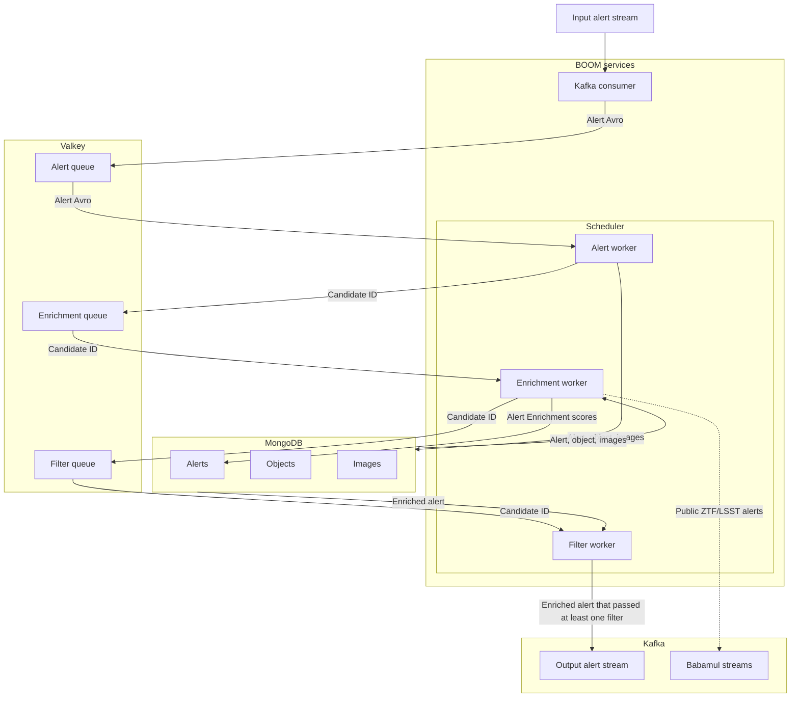

# Alert processing

BOOM consumes Kafka streams of alerts from astronomical surveys
and outputs Kafka streams for consumers like SkyPortal.

Each alert is processed with the following pipeline:

1. Alerts are normalized to unify their schemas as much as possible.
   Their data is split and inserted into an alert dataset,
   an object dataset, and an image dataset, named according to the survey
   with which it is associated.
2. Cross-matches with object IDs from other data catalogs
   (from both live and archival surveys) are added.
   This is done based on the location (right ascension and declination)
   of the object in the alert.
3. Machine learning model classification scores and other properties are added
   to "enrich" the alerts.
4. A set of user-defined filters are applied.
   Any alert that passes through at least one filter is sent
   to a dedicated Kafka output stream for that alert's input stream.

Data flows through the system as follows:

MongoDB serves as the storage, cross-matching, and filtering engine.

When scaling the system to include additional live survey input streams,
each one will have its own:

- Kafka consumer
- Alert queue
- Alert workers
- Enrichment queue
- Enrichment workers
- Filter queue
- Filter workers
- Alert collection
- Object collection
- Image collection
- Output stream
