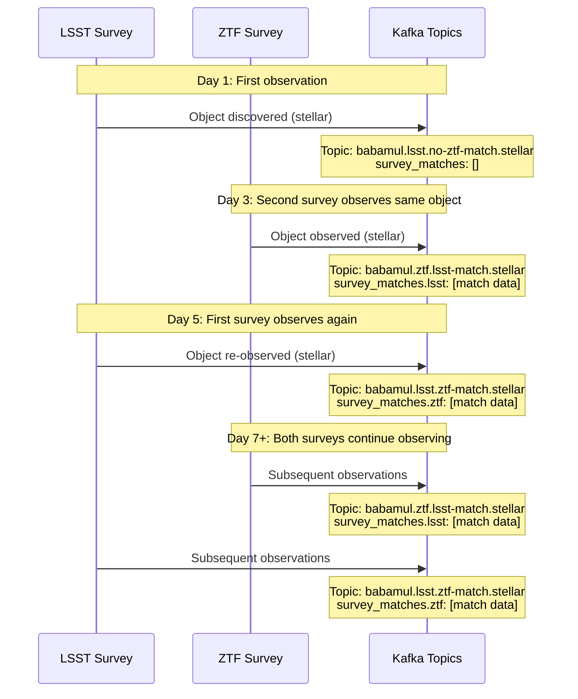
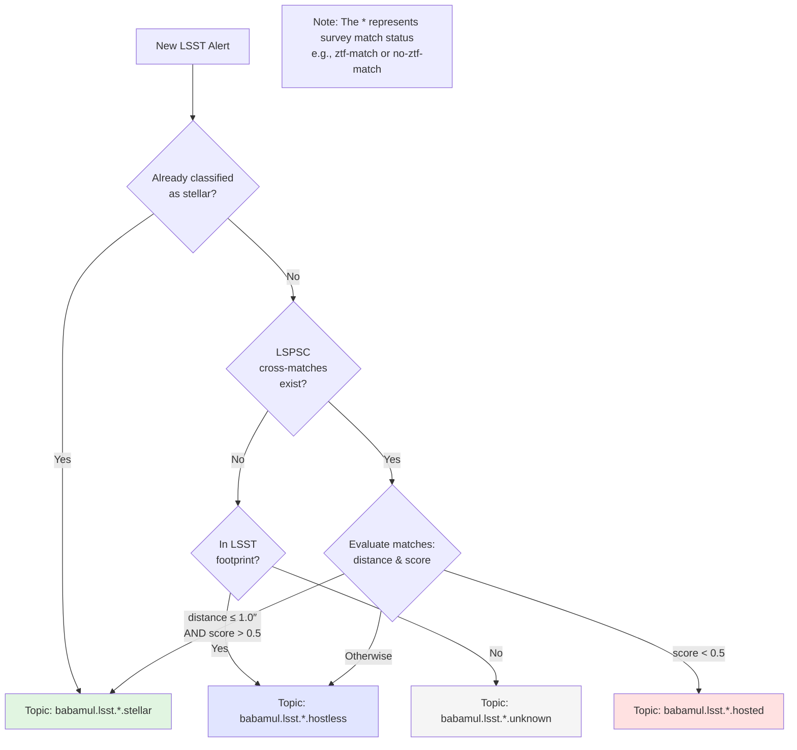

# Babamul

BOOM's Babamul feature provides public access to BOOM's
transient alert streams via Kafka.
Users sign up with an email address and receive credentials for both Kafka
stream access and optional API endpoints.

**Interactive documentation**: `/babamul/docs` (Swagger UI)

## Account separation

Babamul accounts are isolated from main BOOM API accounts:

- **Database**: Stored in separate `babamul_users` collection
- **JWT claims**: Subject contains `babamul:` prefix (e.g., `babamul:{user_id}`)
- **Access control**: Middleware rejects Babamul tokens on main API endpoints
- **Permissions**: Babamul users can only access `/babamul/*`
  endpoints and `babamul.*` Kafka topics

## Authentication flow

1. **Signup** (`POST /babamul/signup`): User provides email, system creates account with activation code
2. **Activation** (`POST /babamul/activate`): User submits activation code, receives 32-character password (shown once)
3. **Kafka access**: Use email + password with SCRAM-SHA-512 authentication
4. **API access** (`POST /babamul/auth`): Exchange email + password for JWT token

## Kafka access

After activation, connect to Kafka using:

- **Username**: Email address
- **Password**: Password from activation response
- **Mechanism**: SCRAM-SHA-512
- **Topics**: `babamul.*` (READ, DESCRIBE)
- **Consumer Groups**: `babamul-*` (READ)

### Example (Python)

This example uses the `confluent_kafka` package.

```python
from confluent_kafka import Consumer

# Subscribe to the babamul.none topic, which includes alerts that aren't
# stars, aren't galaxies, and have no cross-matches
consumer = Consumer(
    {
        "bootstrap.servers": "kafka.boom.example.com:9092",
        "security.protocol": "SASL_PLAINTEXT",
        "sasl.mechanism": "SCRAM-SHA-512",
        "sasl.username": "user@example.com",
        "sasl.password": "your-password-here",
        "group.id": "babamul-myapp",
        "auto.offset.reset": "earliest"
    }
)

consumer.subscribe(["babamul.none"])

try:
    while True:
        msg = consumer.poll(timeout=1.0)
        if msg is None:
            continue
        if msg.error():
            print(f"Consumer error: {msg.error()}")
            continue
        print(msg.value())
finally:
    consumer.close()
```

## Object appearance in output topics

When the same object has been observed by multiple surveys,
it will show up in the `survey_matches` of an alert message,
which will be sent to
a topic like `babamul.{source_survey}.{other_survey}-match.*`.

For a newly-discovered object,
the first alert will have empty `survey_matches`.
If the object is subsequently observed by another survey, it will
contain a match from the first.
From that point onward, alerts on both streams will have `survey_matches`
populated.

### Multi-survey object appearance flow



### Archival catalog cross-match flow

The classification suffix (stellar/hosted/hostless/unknown)
is determined by cross-matching against archival catalogs like LSPSC.
This happens independently of survey cross-matches.


